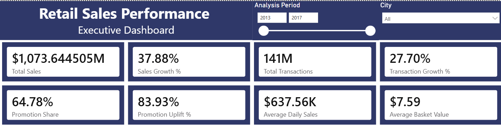
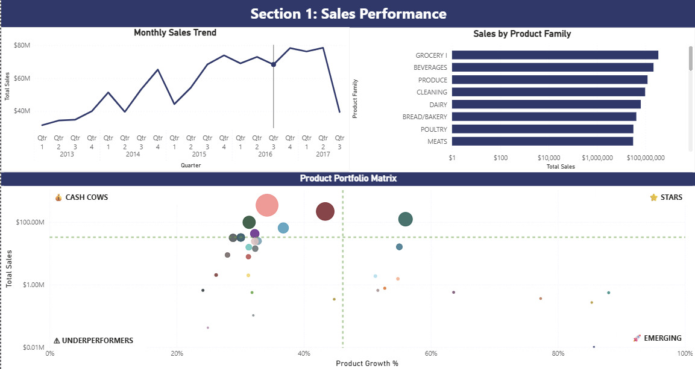
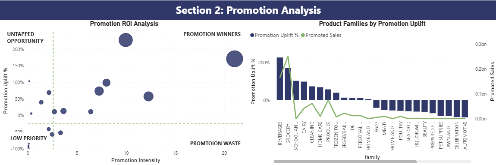
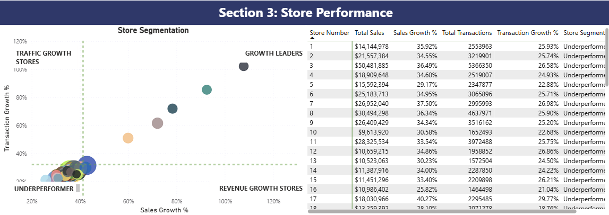
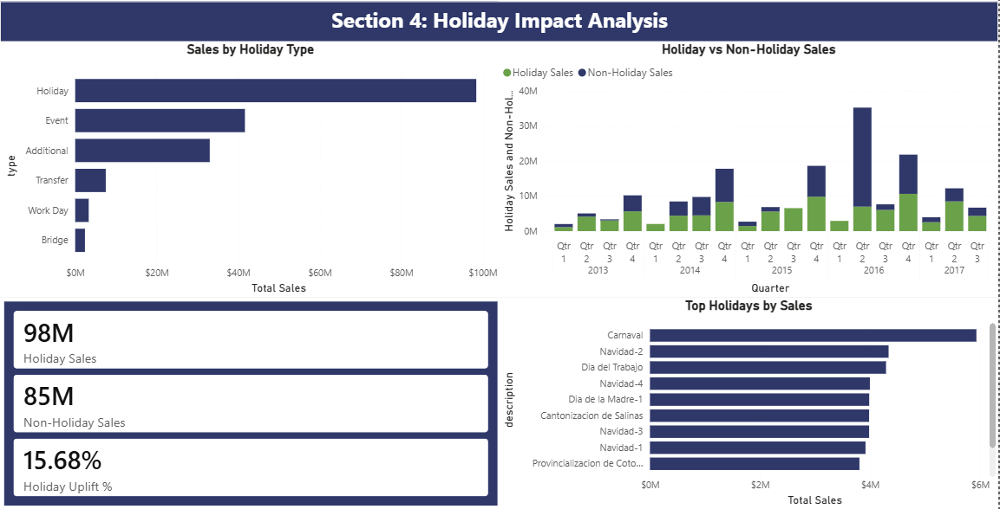
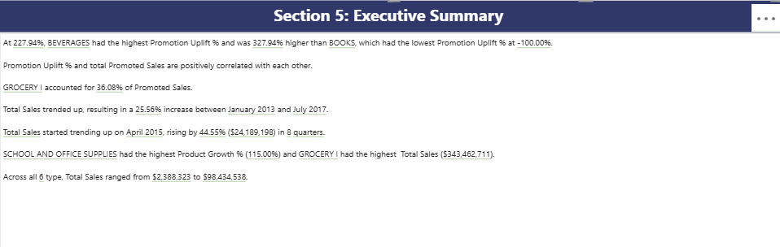

# Retail Sales Performance Dashboard

## Project Overview

This project is an interactive Power BI dashboard designed to analyze retail sales performance across stores, categories, promotions, and holiday periods.

The dashboard helps stakeholders:

- Monitor sales performance
- Evaluate promotion effectiveness
- Identify high and low-performing stores
- Analyze holiday impact on revenue
- Support data-driven decision making

---

## Tools & Technologies

- Power BI
- DAX
- Power Query
- Data Modeling
- Data Visualization

---

## Dashboard Pages

### Dashboard Overview

---

### Sales Analysis
Analyzes sales trends, category performance, and revenue distribution.

---

### Promotion Analysis
Evaluates promotional performance and promotion uplift.

---

### Store Analysis
Compares store performance and identifies efficient and underperforming stores.

---

### Holiday Analysis
Examines the impact of holidays and events on sales performance.

---

## Key Insights

- Promotions increased sales in selected categories but showed varying effectiveness across stores.
- Holiday periods generated significant revenue increases compared to non-holiday periods.
- Store segmentation identified both high-performing and improvement-opportunity locations.
- Executive KPI monitoring supports faster business decision-making.

---

## Skills Demonstrated

- Data Cleaning
- Data Modeling
- DAX Measures
- Business Intelligence
- Dashboard Design
- KPI Development
- Sales Analytics
- Retail Analytics

---

## Executive Summary
Provides a high-level overview of key KPIs and business performance.

---

## Author

Rubaiyat Shams
